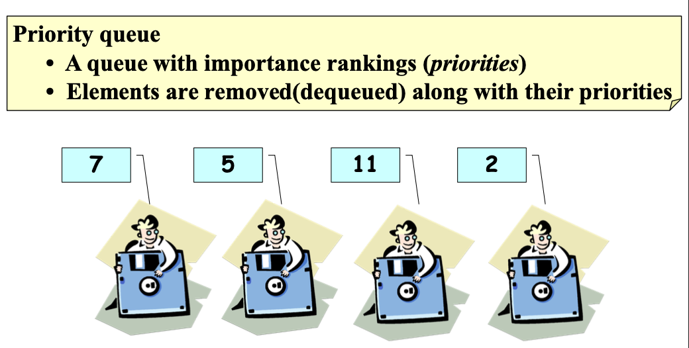

### Prioriy Queue

- born from binary heap
- it's a binary tree based abstract data structure
    - where each element is associated with priority
- element with high priority are served before element with low priority
- normally, low priority tag number means high priority
- 

#### Implementation

- can be implemented using a 
    - list or
    - binary heap

- using list
    - it will be slow
    - cus we have to iterate through all elements in the list everytime to find the element priority tag as the element with hightest priority can be at the end of the list
    - this is a naive approach

- using heap
    - better and efficient approach
    - provides order as to what element to searve next
    - instead of using pure premitive values as node in heap, a class node will be used this time around **

#### Confussion
People confuse Heap with Prioriy Queue. KNOW THAT:
    - Prioriy Queue is an abstract data structure which can be implemented in many ways
    - Binary Heap is an efficient way of implementing the Prioriy Queue concept